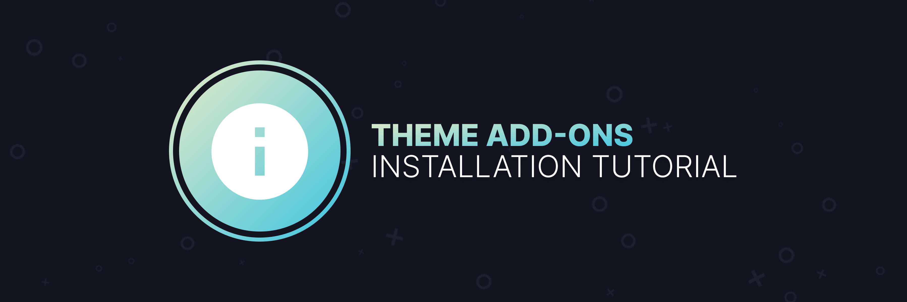

# Discord Theme Add-ons / Mini-Themes
This organization includes all of the theme add-ons (or mini-themes) that I've made. If you're new to using client mods on Discord, contine reading this repo as it can assist you with installation.

## Client Mod Installation
Most of these theme add-ons have support for **multiple client mods, as well as support on web.** A list of supported client mods are:
- **[BetterDiscord](https://betterdiscord.net)**
    - [Client Mod Installation Help](https://github.com/Discord-Theme-Addons/tutorial#betterdiscord-installation)
- **[Powercord](https://powercord.dev)**        
    - [Client Mod Installation Help](https://github.com/Discord-Theme-Addons/tutorial#powercord-installation)
- **[Vizality](https://vizality.com/)**
    - [Client Mod Installation Help](https://github.com/Discord-Theme-Addons/tutorial#vizality-installation)
- **[Stylus (WEB)](https://github.com/openstyles/stylus)**
    - [Client Mod Installation Help](https://github.com/Discord-Theme-Addons/tutorial#stylus-installation)

Now, you may be asking yourself: "okay, so how exactly does this work? are client mods against tos? how do i get the amazing themes?" 
- For information on how to install specific client mods, continue reading this repo. Find the desired client mod, preferabbly the easiest one to install for you, and read the instructions on how to install.
- For information on how to install some of the theme add-ons, all repos in the org come with instructions on how to install the specific theme. 
- As for "is it against ToS?", the short answer is ***yes, it is.*** However, currently **Discord is not going out of their way to terminate users for the usage of client mods**. Note that Stylus isn't exactly against ToS since it doesn't do things that a client mod would do. As long as you don't use anything that absue Discord's API, which the client mods listed above won't allow, you can't really get in much trouble. Though it is your decision if you want to use client mods or not.

### BetterDiscord Mod Installation
1. Download BetterDiscord.
    - **[Wndows](https://github.com/rauenzi/BBDInstaller/releases/download/v1.0.5/BandagedBD.exe)**
    - **[MacOS](https://github.com/rauenzi/BBDInstaller/releases/download/v1.0.5/BandagedBD_Mac.zip)**
    - **[Linux Gist](https://gist.github.com/ObserverOfTime/d7e60eb9aa7fe837545c8cb77cf31172)**
2. Find the location of the installer, right click and "Run as Administrator".
3. Click the "Install BandagedBD" button.
4. Find your Discord Build.
    - Most users will be on stable. If you only have one build of Discord installed it'll be the only selectable one.
5. Click "Install".
    - BetterDiscord will automatically reload Discord for you. If you run into any errors, join one of the support servers listed below and ask for help in the proper channels.
      - **[BetterDiscord Primary Server](https://discord.gg/0Tmfo5ZbORCRqbAd)**
      - **[BetterDiscord Secondary Server](https://discord.gg/2HScm8j)**
6. Congrats, you now have BetterDiscord installed!

If at any time you would like to uninstall BetterDiscord:
1. Open the launcher as you did last time.
2. Click the "Uninstall BandagedBD" button.
3. Find the build you installed it on and selected it.
4. BetterDiscord should uninstall sucesfully. If you have any issues uninstalling, join one of the support servers listed above and ask for help in the proper channel.

For more information on BetterDiscord, you can visit their site **[here](https://betterdiscord.net/)**.

### Powercord Mod Installation
1. Before continuing, please make sure you have the following things downloaded and installed.
    - **[git](https://git-scm.com/downloads)**
    - **[node & npm](https://nodejs.org/en/)**
    - **Discord Canary, as Powercord only works on this build.**
        - **[Windows](https://discord.com/api/download/canary?platform=win)**
        - **[MacOS](https://discord.com/api/download/canary?platform=osx)**
        - **[Linux](https://discord.com/api/download/canary?platform=linux)**
    - Please note that you can only have one client mod injected, if you have two injected at the same time it will not work properly.
2. Open a command prompt / terminal of choice.
    - On Windows, use command prompt (or something such as git bash will work as well).
        - **DO NOT RUN CMD AS ADMIN, OTHERWISE POWERCORD WILL FAIL TO INJECT.**
    - On MacOS/Linux, terminal (or terminal of choice).
3. In chronological order, run each of these commands in the prompt / terminal you just ran.
    1. `git clone https://github.com/powercord-org/powercord`
    2. `cd powercord`
    3. `npm i`
    4. `npm run plug` ***(Linux users: you’ll need to run this command with `sudo`)***.
4. Completely restart your Discord Client by right clicking the icon in your syhstem tray, and pressing "Quit Discord".
5. When Discord starts up, Powercord should be injected!

If at any time you would like to uninstall Powercord:
1. Open a command prompt / terminal of choice.
2. Navigate to your current existing Powercord installation.
3. Run `npm run unplug` ***(Linux users: you’ll need to run this command with `sudo`)***.
4. Completely restart your Discord Client by right clicking the icon in your syhstem tray, and pressing "Quit Discord".
5. When Discord starts up, Powercord should no longer be injected.

For more information on Powercord, you can visit their site **[here](https://powercord.dev/)**.

### Vizality Mod Installation
Vizality is currently unavaible for installation, as it is currently in an Alpha testing stage. For more information on Vizality, you can visit their site **[here](https://vizality.com/)**.

### Stylus Installation
1. Install the Stylus extension, which can be found on:
    - [Chrome](https://chrome.google.com/webstore/detail/stylus/clngdbkpkpeebahjckkjfobafhncgmne)
    - [Firefox](https://addons.mozilla.org/en-US/firefox/addon/styl-us/) 
    - [Opera](https://github.com/openstyles/stylus/wiki/Opera,-Outdated-Stylus).
2. That's all there really is to it.

For more information on Stylus, you can visit the repo **[here](https://github.com/openstyles/stylus)**

## Theme Installation
All repos on this org have basic installation instructions. For those that are new to this, I recommend reading below for the specific client mod you're using.

### BetterDiscord Theme Installation
1. Open your User Settings.
2. Scroll down and find the "Themes" tab and click it.
3. Locate the "Open Themes Folder" button.
4. Download the desired mini-theme, and drag it into the themes folder. 
    - All repos on this org that have support for BetterDiscord will be listed under "For BetterDiscord". Click the "Direct Download" hyperlinke (aka link) to install the theme.
5. Go back to Discord and enable the theme you just added.

### Powercord Theme Installation
1. Open a command prompt / terminal of choice.
2. Run this command in the prompt / terminal you just opened:
    - `cd powercord/src/powercord/themes && git clone https://github.com/Discord-Theme-Addons/REPO-NAME`
3. Focus Discord and reload using `CTRL` + `R`.

### Stylus Theme Installation
1. Find the desired mini-theme on this repo.
2. All repos on this org that have support for Stylus will be listed under "For Browser / Web". Follow the installation link.
3. Press "Install Style".
